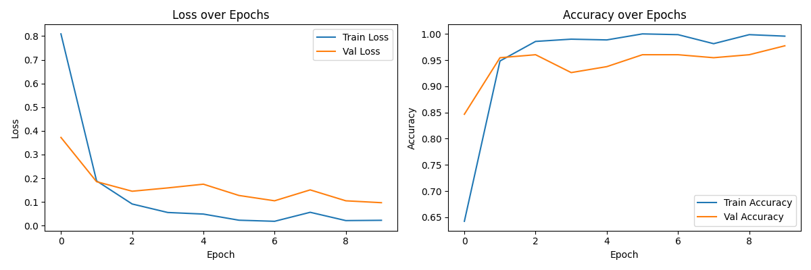

# Thai Receipt Orientation Classification

A deep learning image classification pipeline built with **PyTorch** to detect and classify the physical orientation of Thai receipts, bills, and everyday retail documents into four classes: **0° (upright), 90°, 180° (upside down), and 270°**.

Developed as an individual course project for **AI Concepts**.

---

## 📌 Project Overview

Document scanning and automated OCR pipelines frequently encounter receipts captured upside down or sideways. This project trains a convolutional neural network backbone to automate orientation correction prior to downstream OCR processing.

- **Framework:** PyTorch (`torch`, `torchvision`)
- **Backbone Architecture:** ResNet-18 (Transfer Learning with pre-trained ImageNet weights)
- **Target Classes:** 4 (`0°`, `90°`, `180°`, `270°`)
- **Dataset Size:** 200+ unique original documents expanded via 4-way rotation to 800+ labeled images
- **Acceleration:** Apple Silicon Metal Performance Shaders (`mps`) / CUDA / CPU fallback

---

## 🏗️ Model Architecture & Training Details

| Component | Specification | Description |
| :--- | :--- | :--- |
| **Backbone** | ResNet-18 | Pre-trained feature extractor leveraging residual/skip connections to avoid vanishing gradients. |
| **Classification Head** | `nn.Linear(512, 4)` | Replaced default 1,000-class head with a 4-class linear layer. |
| **Loss Function** | Cross-Entropy Loss | Measures multi-class error using softmax probabilities. |
| **Optimizer** | Adam (`lr=1e-4`) | Adaptive moment estimation for stable fine-tuning. |
| **Batch Size** | 16 | Balanced memory efficiency and gradient stability. |
| **Epochs** | 10 | Rapid convergence without overfitting receipt layouts. |
| **Input Resolution** | 224 × 224 | Normalized to ImageNet mean `[0.485, 0.456, 0.406]` and std `[0.229, 0.224, 0.225]`. |

### Data Leakage Prevention Strategy

To prevent data leakage, original receipts are partitioned into **Training (80%)** and **Validation (20%)** sets **prior** to rotational transformations. All rotated variations of any given original document remain strictly within the same split.

---

## 📁 Repository Structure

```text
.
├── prepare_dataset.py       # Splits original images and generates 4-class rotations
├── train_model.py           # Fine-tunes ResNet-18 and plots loss/accuracy curves
├── predict.py               # Runs single-image inference using saved weights
├── compare_model.py         # Evaluates different models on your testing images
├── package_submission.py    # Packages dataset into clean submission ZIP
├── training_results.png     # Train/Val loss and accuracy curves
```

---

## 🚀 Usage

### 1. Requirements

```bash
pip install torch torchvision pillow matplotlib
```

### 2. Dataset Preparation

Place all upright original receipt images into `dataset/raw_originals/`, then run:

```bash
python3 prepare_dataset.py
```

### 3. Model Training

Train the model and save the best checkpoint:

```bash
python3 train_model.py
```

This outputs `receipt_orientation_model.pth` and saves learning curves to `training_results.png`.

### 4. Single-Image Inference

Evaluate a single image:

```bash
python3 predict.py path/to/receipt.jpg
```

Example output:

```text
Image: test_receipt.jpg | Predicted Orientation: 90° (Confidence: 98.7%)
```

### 5. Exam Day Batch Prediction

Run automated inference on a directory containing instructor-provided test images:

```bash
python3 predict_folder.py path/to/exam_images_folder/
```

### 6. Dataset Packaging (Assignment Submission)

Export all labeled images into a unified `dataset/` directory structure compressed as `receipt_dataset.zip`:

```bash
python3 package_submission.py
```

---

## 📊 Training Results

- **Validation Accuracy:** ≥ 97%
- **Inference Speed:** < 25 ms per document on Apple Silicon (`mps`) / CPU

The model demonstrates strong invariance to thermal paper folds, merchant logos, and bilingual (Thai-English) document formats.


